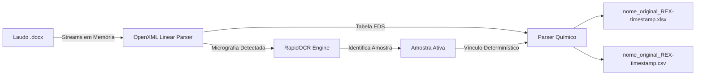

# 🔬 REX — MEV-EDS Report Extractor

[](https://www.python.org/downloads/)
[-green.svg)](https://github.com/RapidAI/RapidOCR)
[](LICENSE)
[]()

> **REX** (*MEV-EDS Report Extractor*) é uma ferramenta determinística e de alta precisão para extração, estruturação e correlação de dados quantitativos de espectroscopia EDS e micrografias contidas em laudos laboratoriais do Microsoft Word (`.docx`).

---

## 🚀 Principais Recursos

* **⚡ 100% em Memória**: Processa arquivos grandes de laudo diretamente em streams de memória (`zipfile.ZipFile`), sem criar cópias `.zip` e sem I/O desnecessário em disco.
* **🎯 Precisão Determinística Linear**: Elimina descompassos de alinhamento associando tabelas de medição diretamente à micrografia que as antecede no fluxo OpenXML (`document.xml`).
* **🧠 RapidOCR Integrado (ONNX Runtime)**: Dispensa completamente a instalação manual de binários externos como o Tesseract (`tesseract.exe`). Alta acurácia (>91%) em milissegundos rodando exclusivamente em CPU.
* **🌐 Interface Web Local Zero-Dependency**: Dashboard local moderno no navegador, compatível instantaneamente com qualquer Linux, Windows e macOS sem necessidade de `sudo` ou pacotes gráficos do sistema.
* **💻 Interface Desktop Nativa**: Opção desktop em `CustomTkinter` com tema escuro, barra de progresso em tempo real e visualização de dados tabulares.
* **📊 Exportação Dupla**: Gera planilhas Excel (`.xlsx`) com abas estruturadas e arquivos `CSV` em `utf-8-sig`.
  Ambos usam o nome do DOCX seguido de `_REX-AAAAMMDD-HHMMSS-microssegundos`, com extensões `.xlsx` e `.csv`. O CSV sempre reúne todas as amostras.
* **🛡️ Validação Preventiva**: Aplica limites de tamanho, conteúdo descompactado, XML, imagens e taxa de compactação antes do processamento.
* **💾 Exportação Segura**: Valida os novos arquivos antes da substituição e restaura os resultados anteriores se a gravação falhar.

---

## 🛠️ Instalação

Clone o repositório e configure o ambiente virtual:

```bash
git clone https://github.com/rodrigofpo/rex.git
cd rex

# Criar ambiente virtual
python3 -m venv .venv
source .venv/bin/activate  # No Windows: .venv\Scripts\activate

# Instalar dependências
pip install -r requirements.txt

# Ou instalar como pacote editável:
pip install -e .
```

---

## 📖 Como Usar

O REX oferece 3 formas simples de uso através do seu comando de terminal:

### 1. Linha de Comando (CLI)

Extraia os dados de qualquer laudo diretamente pelo terminal:

```bash
# Execução simples:
python -m rex extract "laudo_amostras.docx"

# Ou especificando pasta de saída:
python -m rex extract "laudo_amostras.docx" -o ./resultados

# Gerar uma planilha individual para cada amostra no mesmo arquivo Excel:
python -m rex extract "laudo_amostras.docx" --workbook-mode per-sample
```

### 2. Interface Web Local (Recomendada para Linux/Servidores)

Inicie a interface web local que abre automaticamente no seu navegador padrão:

```bash
python -m rex web
# Acessível em: http://localhost:8085
```

* **Vantagens**: Não requer pacotes `tkinter` do sistema, inclui tabela de pré-visualização, cartões de métricas químicas e botões diretos de download.

### 3. Interface Desktop Nativa (CustomTkinter)

Para abrir a janela desktop interativa:

```bash
python -m rex gui
```

*(No Fedora/RHEL, certifique-se de ter o pacote `python3-tkinter` instalado: `sudo dnf install python3-tkinter`)*.

---

## 📐 Arquitetura do Pipeline



### Estrutura do Pacote

```text
rex/
├── rex/                        # Pacote Python principal
│   ├── core/
│   │   └── engine.py           # Motor de extração determinístico (RapidOCR + OpenXML)
│   ├── ui/
│   │   ├── web.py              # Interface Web local embutida
│   │   └── desktop.py          # Interface Desktop em CustomTkinter
│   ├── cli.py                  # Ponto de entrada CLI unificado
│   └── __main__.py             # Suporte a `python -m rex`
├── docs/                       # Documentação detalhada e diagramas
├── tests/                      # Testes automatizados
├── pyproject.toml              # Configuração moderna de build (PEP 621)
├── requirements.txt            # Dependências travadas
└── README.md
```

---

## 📊 Estrutura dos Dados Exportados

Os arquivos Excel (`.xlsx`) e CSV gerados contêm as seguintes colunas padronizadas:

Por padrão, o Excel mantém as planilhas consolidadas `DadosCompletos` e
`AmostrasDetectadas`. Com `--workbook-mode per-sample`, a primeira planilha contém
o resumo das amostras detectadas e cada amostra recebe uma planilha individual com
todos os seus pontos, séries e medições químicas.

| Coluna | Descrição | Exemplo |
| :--- | :--- | :--- |
| `Amostra` | Rótulo/código identificado via OCR | `A01 externo 071815` |
| `Micrografia` | Imagem física de origem no laudo | `media/image1.png` |
| `Serie` | Subsérie de análise da amostra | `1` |
| `Ponto` | Ponto específico de análise pontual EDS | `1`, `2`, `3`... |
| `Elemento` | Símbolo químico validado | `Si`, `Al`, `Fe`, `O` |
| `TipoLinha` | Tipo da linha de emissão de raios X | `K series` |
| `PercentualPeso` | Concentração em % de peso | `59.57` |
| `SigmaPeso` | Desvio / incerteza padrão | `0.23` |
| `PercentualAtomico` | Concentração em % atômica | `73.86` |

---

## 📄 Licença

Distribuído sob a licença **MIT**. Veja o arquivo [LICENSE](LICENSE) para mais detalhes.

**Autor**: Rodrigo Fernando Pinheiro Oliveira<br>
**Repositório**: [https://github.com/rodrigofpo/rex](https://github.com/rodrigofpo/rex)
