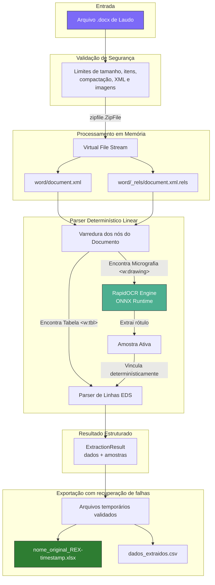

# Arquitetura e Engenharia do REX

O **REX (MEV-EDS Report Extractor)** foi projetado para resolver o problema de correlação e extração de dados quantitativos em laudos laboratoriais de Microscopia Eletrônica de Varredura (MEV) e Espectroscopia por Dispersão em Energia (EDS).

---

## 1. Fluxo de Execução Linear (In-Memory)

---

## 2. Decisões Arquiteturais Fundamentais

1. **Eliminação do Tesseract Exclusivo**:
   - O uso do `rapidocr-onnxruntime` permite que o motor rode sem necessitar da instalação de executáveis externos no sistema operacional (`tesseract.exe`), alcançando alta taxa de reconhecimento (>91%) em milissegundos.
2. **Correlação Linear contra Quebra de Agrupamento**:
   - Em laudos onde uma amostra possui múltiplas áreas de varredura (repetindo `Point 1`), abordagens baseadas em incrementar `group_id` a cada `Point == 1` quebram. O REX só altera a amostra quando encontra uma nova micrografia física na árvore do OpenXML.
3. **Mapeamento de Transparência**:
   - Imagens de microscopia extraídas frequentemente contêm texto preto sobre canal alfa transparente. O REX realiza a composição em uma camada de fundo branco na memória antes do OCR, evitando que o texto fique invisível (preto sobre preto).
4. **Separação entre extração e persistência**:
   - `EDSExtractorEngine.extract()` produz um `ExtractionResult` sem gravar arquivos. A camada `exporter` persiste Excel e CSV, enquanto `process()` mantém compatibilidade com as interfaces existentes.
5. **OCR sob demanda**:
   - RapidOCR, Pillow e NumPy só são carregados quando uma imagem elegível realmente precisa de OCR. A instância do mecanismo é reutilizada durante toda a extração.
6. **Falhas previsíveis e arquivos preservados**:
   - Erros de documento, limites, inicialização do OCR e exportação possuem exceções de domínio. Os arquivos de saída são gerados e validados em diretório temporário antes da substituição dos resultados anteriores.

## 3. Limites preventivos padrão

O módulo `rex.security` valida metadados do contêiner antes de ler seu conteúdo. Os limites padrão são configuráveis por `DocumentLimits` e cobrem tamanho do DOCX, quantidade de itens, volume descompactado, taxa de compactação, XMLs, imagens e quantidade de pixels.

Esses controles reduzem o risco de exaustão acidental ou maliciosa de memória e CPU, mas não transformam documentos não confiáveis em conteúdo seguro para outras ferramentas externas.
